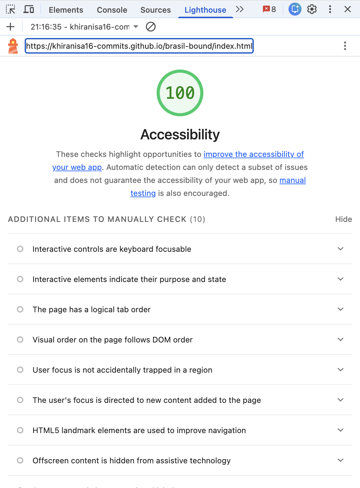
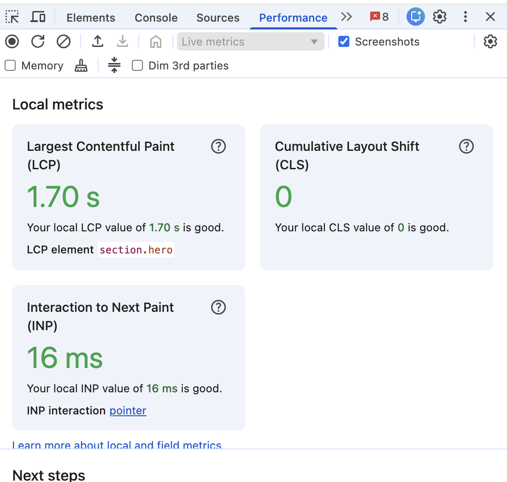
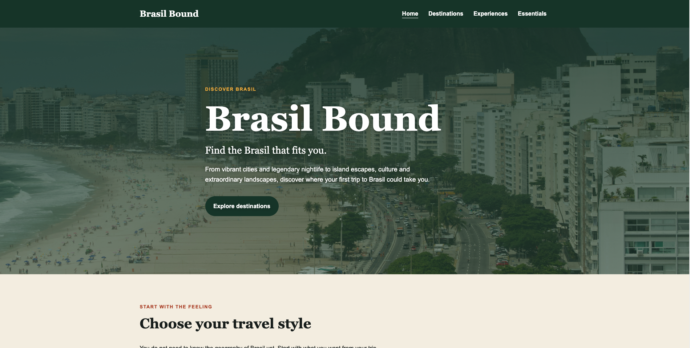
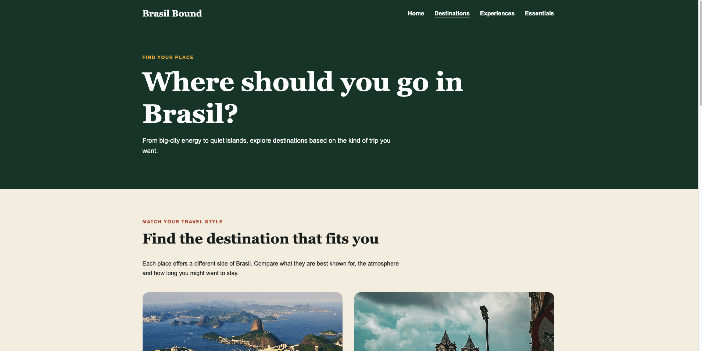
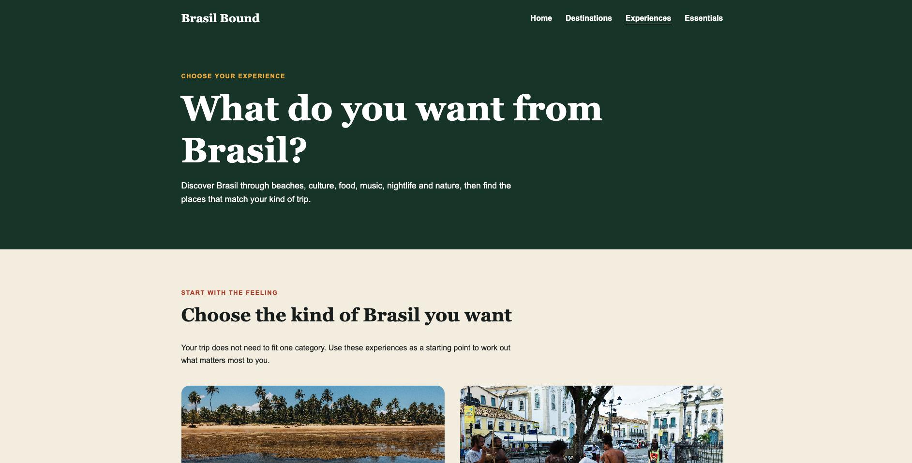
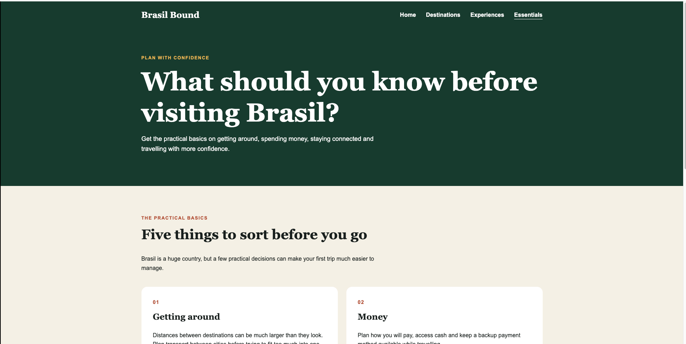
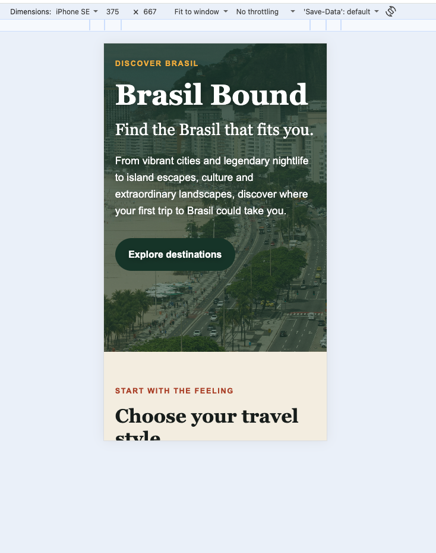

# Brasil Bound

Brasil Bound is a responsive travel discovery website designed to help first-time visitors to Brasil understand the country's destinations, experiences and practical travel considerations.

## Project Status

Complete and deployed.

## User Experience

### Project Purpose

Brasil Bound is designed to help first-time visitors to Brasil plan their trip with more confidence.

Brasil is a large and diverse country, and travellers can easily feel overwhelmed when deciding where to go, what different destinations offer and how to prepare for their trip.

The website aims to make this process easier by organising information around the experiences travellers are looking for, while also providing practical travel guidance in a clear and accessible format.

### Target Audience

Brasil Bound is primarily aimed at:

- First-time visitors to Brasil
- Independent and solo travellers
- Travellers aged approximately 20–35
- People interested in beaches, culture, nightlife, food and adventure
- Travellers who want useful information without having to research across many different websites

### User Goals

Users should be able to:

- Understand what different Brasilian destinations offer
- Discover destinations based on their interests
- Find practical information for planning a first trip
- Explore Brasilian culture and travel experiences
- Access the website easily on desktop, tablet and mobile

### User Stories

#### First-time visitor

As a first-time visitor to Brasil, I want to understand what different destinations offer so that I can decide where I would most enjoy visiting.

#### Experience-led traveller

As a traveller who knows the type of trip I want but not the geography of Brasil, I want destinations organised by interests such as beaches, culture, nightlife and adventure so that I can quickly find suitable places.

#### Practical planner

As someone planning my first trip to Brasil, I want essential travel information in one place so that I do not need to search across multiple websites.

#### Mobile user

As a traveller using my phone to research and plan, I want the website to work clearly on smaller screens so that I can access information wherever I am.

#### Accessibility-conscious user

As a user with accessibility needs, I want clear structure, readable contrast and meaningful image alternatives so that I can navigate and understand the website comfortably.

#### Curious traveller

As someone interested in the culture and experiences of Brasil, I want to discover food, music, nature and nightlife so that I can plan a trip that feels more meaningful than simply visiting famous landmarks.

### Sitemap

Brasil Bound uses a simple four-page structure so users can move between discovery, destination research, experiences and practical planning without becoming overwhelmed. 

- **Home** (`index.html`)
  - Introduces Brasil Bound
  - Explains the purpose of the website
  - Highlights different travel styles
  - Directs users towards destinations, experiences and practical guidance

- **Destinations** (`destinations.html`)
  - Helps users compare places in Brasil
  - Organises destinations by the type of experiences they offer
  - Includes useful information such as best for, atmosphere and suggested length of stay

- **Experiences** (`experiences.html`)
  - Explores beaches, culture, food, music, nightlife and nature
  - Helps users discover what kind of trip they want
  - Uses strong visual content and clear categories

- **Essentials** (`essentials.html`)
  - Provides practical information for first-time visitors
  - Covers transport, money, safety, connectivity, language and trip preparation

## Design

### Colour Palette

The colour palette was selected to reflect the warmth, nature and energy
associated with Brasil while maintaining a modern travel-editorial appearance.

- Forest Green: `#163B2D`
- Terracotta: `#B2472B`
- Sun Yellow: `#F2B544`
- Sand: `#F5EFE4`
- Dark Text: `#18201D`
- White: `#FFFFFF`

The original terracotta accent was adjusted during accessibility testing
because it did not provide sufficient contrast for small text. The final
palette was retested using Lighthouse and achieved an accessibility score
of 100 across all four pages.

### Typography

Georgia is used for major headings to create an editorial travel style. 

Arial, Helvetica and sans-serif system fonts are used for body content to maintain readability and performance across devices. 

## Testing

The Brasil Bound website was tested throughout development to check functionality, responsiveness, accessibility and code quality.

### HTML Validation

All HTML pages were tested using the W3C Markup Validation Service.

| Page | Result |
| --- | --- |
| `index.html` | Pass - no errors |
| `destinations.html` | Pass - no errors |
| `experiences.html` | Pass - no errors |
| `essentials.html` | Pass - no errors |

### CSS Validation
`asset/css/style.css` was tested using the W3C CSS Validation Service.

**Result:** Pass - no errors found.

### Responsive Testing

The website was manually tested at different viewport sizes using Chrome DevTools.

| Viewport | Result |
| --- | --- |
| Mobile - 375px | Pass |
| Tablet - 1024px | Pass |
| Desktop | Pass |

Testing checked that:

- content remained within the viewport
- navigation remained usable
- headings wrapped correctly
- images did not overflow
- grid layouts adapted to smaller screens
- buttons remained readable and usable

### Keyboard Testing

The website was tested using keyboard navigation only.

The skip link becomes visible when focused and allows users to bypass the navigation and move directly to the main content.

All links and calls to action can be reached using the Tab key, with a visible focus indicator and logical focus order. 

**Result:** Pass.

### Link Testing

All internal navigation links and calls to action were manually tested.

No broken internal links were found.

**Result:** Pass

### Accessibility Testing

Each page was tested using the Lighthouse accessibility audit in Chrome DevTools after manual keyboard testing and colour contrast improvements. 

| Page | Lighthouse Accessibility |
| --- | --- |
| Home | 100 |
| Destinations | 100 |
| Experiences | 100 |
| Essentials | 100 |

During testing, the original terracotta accent colour did not provide sufficient contrast for small text. The colour was darkened on light backgrounds and yellow was used for eyebrow text on dark green backgrounds. 

After these changes, the pages achieved a Lighthouse accessibility score of 100.

### Performance Testing

The deployed homepage was checked using Chrome's local performance metrics.

| Metrics | Result | Assessment |
| --- | --- | --- |
| Largest Contentful Paint (LCP) | 1.70 s | Good |
| Cumulative Layout Shift (CLS) | 0 | Good |
| Interaction to Next Paint (INP) | 16 ms | Good |

The results showed that the main content loaded quickly, the page did not shift unexpectedly during loading and interactions responded quickly.

These measurements were recorded locally and may vary depending on the visitor's device, connection and network conditions.

### Browser Testing

That deployed website was manually tested in multiple browsers to check that the layout, navigation, images and responsive behaviour remained consistent.

| Browser | Result |
| --- | --- | 
| Google | Chrome | Pass |
| Safari | Pass |

No browser-specific layout or functionality issues were found.

## Final Website

### Homepage

The homepage helps first-time visitors understand the purpose of the site and begin exploring Brasil based on their travel interests.

### Destinations

The destinations page allows users to compare locations by travel style, atmosphere and suggested stay length.

### Experiences

The experience page supports users who prefer to choose a trip based on interests such as beaches, culture, nature and nightlife.

### Essentials

The essentials page gives first-time visitors practical guidance on transport, money, connectivity, safety and language before travelling.

### Responsive Design

The interface adapts for smaller screens by resizing typography, wrapping navigation and changing multi-column layouts into mobile-friendly layouts.

## Credits

### Images

All photography used in Brasil Bound was sourced from Unsplash and is
used under the Unsplash Licence.

| Website image | Photographer | Location / subject |
| --- | --- | --- |
| `hero-rio-coast.jpg` | Frank MANICAPELLI | Copacabana beach and Sugarloaf Mountain, Rio de Janeiro |
| `style-beach.jpg` | Jonathan Borba | Taipu de Fora, Bahia |
| `style-culture.jpg` | Nigel SB Photography | Capoeira in Pelourinho, Salvador |
| `style-adventure.jpg` | Diego Costa | Cachoeira do Mosquito, Lençóis, Bahia |
| `style-city.jpg` | Pedro Nogueira | Avenida Paulista, São Paulo |
| `destination-rio.jpg` | gustavo nacht | Rio de Janeiro |
| `destination-salvador.jpg` | Michael Douglas | Pelourinho, Salvador |
| `destination-ilha-grande.jpg` | iker | Lopes Mendes Beach, Ilha Grande |
| `destination-florianopolis.jpg` | will dornelles | Praia dos Ingleses, Florianópolis |
| `why-brasil.jpg` | Seiji Seiji | Lençóis Maranhenses |

### Content

All written content for Brasil Bound was created specifically for this project.

## Wireframes and Planning

Before development, I sketched the homepage structure and responsive
wireframes by hand. These were used to plan the content hierarchy,
navigation and how sections would adapt between desktop and mobile.

### Homepage Structure

This initial plan established the order of the main homepage sections:
navigation, hero, travel styles, Why Brasil, featured destinations,
planning information and footer.

### Desktop Wireframe

The desktop wireframe explored a wider layout with horizontal navigation,
four travel-style cards, split content sections and featured destination
cards.

### Mobile Wireframe

The mobile wireframe explored how the same content could be stacked for
a smaller screen while maintaining the same information hierarchy.

The final implementation evolved slightly during development and testing.
For example, some navigation and card layouts were simplified to improve
responsiveness and usability.

## Deployment

The website is deployed using GitHub Pages.

### Live Website

[View Brasil Bound](https://khiranisa16-commits.github.io/brasil-bound/)

### Repository

[View the GitHub repository](https://github.com/khiranisa16-commits/brasil-bound)

### Deployment Process

1. The project was pushed to the GitHub repository.
2. The repository **Settings** were opened.
3. **Pages** was selected.
4. The source was set to deploy from a branch.
5. The `main` branch and `/root` folder were selected.
6. GitHub Pages generated the live website URL.
7. The deployed website was checked to confirm that pages, images,
   navigation and styles loaded correctly.

Updates pushed to the `main` branch are redeployed automatically by GitHub Pages.
